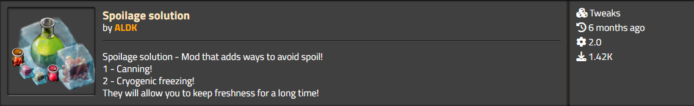

  

<h1 align="center">🥫 Spoilage Solution 🧊</h1>

<em>Smart preservation for perishable items in <strong>Factorio</strong></em>

  🔧 <strong>Category:</strong> Tweaks &nbsp;|&nbsp;
  🧊 <strong>Version:</strong> 2.0 &nbsp;|&nbsp;
  📦 <strong>Downloads:</strong> 1,400+

---

## ✨ Features

**Spoilage Solution** introduces two effective ways to prevent item spoilage:

1. **🥫 Canning** – Seal items into cans for long-term storage.
2. **❄️ Cryogenic Freezing** – Freeze perishables in ultra-low temperatures to halt spoilage entirely.

These mechanics are ideal for survival scenarios, food logistics, or complex automation setups.

---

## 🚀 Installation

- 📦 [Download on the Factorio Mod Portal](https://mods.factorio.com/mod/spoilage-solution)
- 💻 Or clone it manually:
